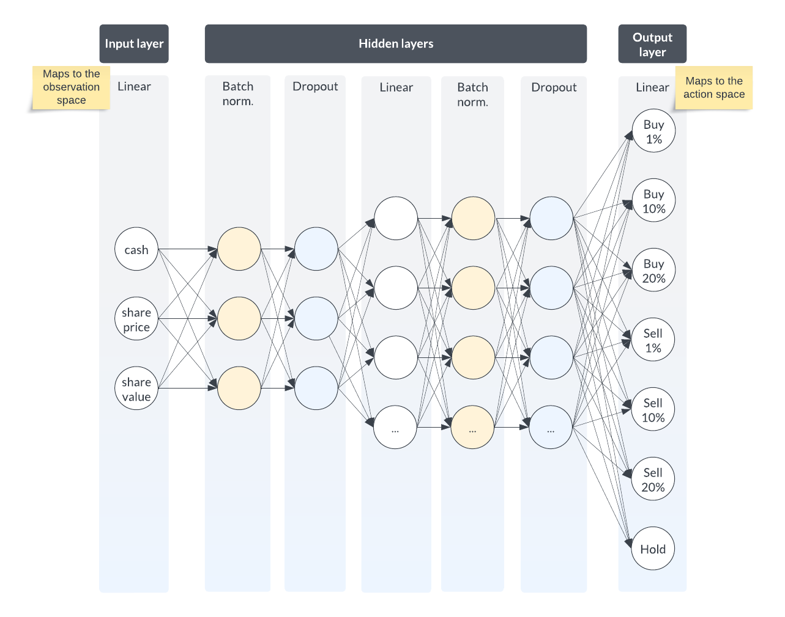

# Algorithmic Trading with Reinforcement Learning

The integration of powerful computer models and methods is primarily responsible for the profound change in the financial trading scene, and algorithmic trading is a sector at the forefront of this change. To develop trading strategies, exploit small market inefficiencies and make precise trading decisions with a speed and frequency that exceeds human capabilities, traders are increasingly relying on algorithmic trading.

Finding an algorithmic method to outperform a stock market index has been the subject of much research and an exceptionally difficult problem to solve. However, recent advances in Deep Reinforcement Learning (DRL) offer a new way to break away from traditional machine learning models, and the initial research results are promising. For example, Briola et al (2021), demonstrated the utility of DRL algorithms in tracking important market trends and adjusting positions during consolidation periods.

Why Deep Reinforcement Learning? In general, it allows our algorithms to learn from their actions by creating a feedback loop to improve performance. By applying this approach to the stock market, I hope to gain insights into the potential, but also the limitations, of AI in financial decision making.

We'll compare a proven conventional trading method, represented by the player Kane, with a DRL-based strategy, represented by the player Abel. While Abel uses a DRL model to dynamically change his trading decisions in response to market behaviour, the standard approach uses a traditional technique such as dollar-cost averaging. The main hypothesis is that Abel's adaptive DRL method will allow him to outperform Kane's traditional approach in terms of return on capital and risk-adjusted ratios.

This project builds on similar work, such as Deng et al. (2017), who demonstrated the success of reinforcement learning on continuous futures contracts by outperforming classic time-series momentum strategies even after taking into account high transaction costs that are common in this type of trades.

By conducting this project, I aim to better understand the potential and limitations of using artificial intelligence, particularly DRL, in financial decision making. The results could be of great importance to traders and investors, potentially giving them a better way to navigate the complex and unstable world of financial markets.
